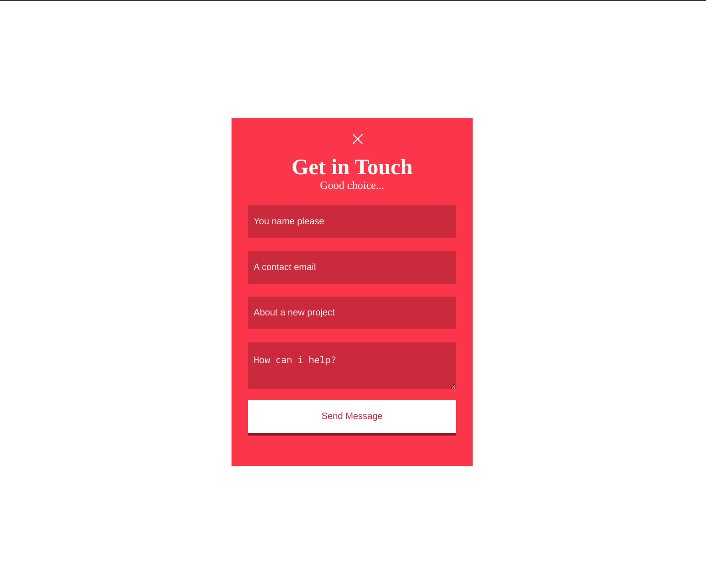
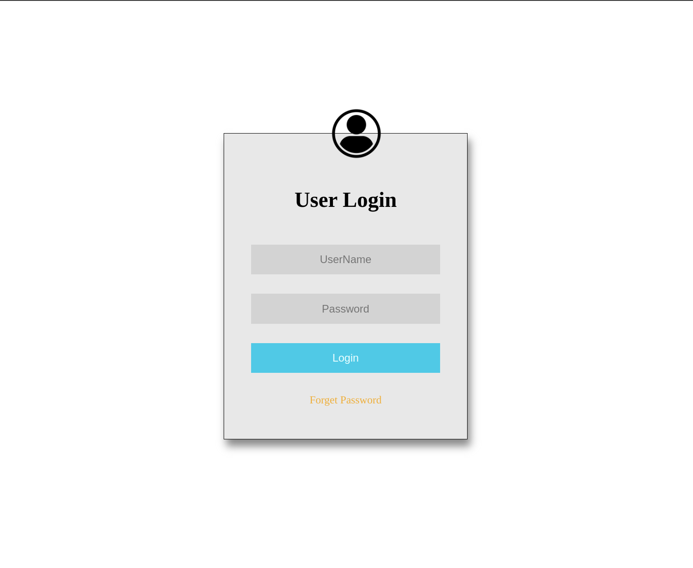

# A collection of pages for per scholas

- We love code
- Go getter
- Practice

This repo is dedicated for per schaolas training, contain all the HTML/CSS part static web pages, all the static part practice assignment will be put in this preo.

# How to run
```
cd ~
mkdir sei_classwork && cd sei_classwork
git clone https://github.com/dc-me/example-pages
```
Run static page how ever you want (with vscode live server, nginx, apache, or open it directly in web browser).

---

# A list of pages (deployed to github pages with links)

[SBA 307 User List](https://dc-me.github.io/example-pages/pages/user-list.html)

[Resume](https://dc-me.github.io/example-pages/pages/resume.html)

[Get in Touch](https://dc-me.github.io/example-pages/pages/contact.html)

[Login](https://dc-me.github.io/example-pages/pages/login.html)
